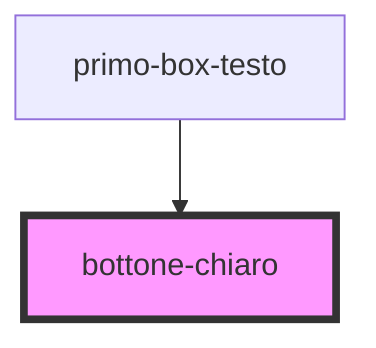

# bottone-chiaro

<!-- Auto Generated Below -->

## Properties

| Property        | Attribute         | Description                          | Type     | Default     |
| --------------- | ----------------- | ------------------------------------ | -------- | ----------- |
| `btnTextChiaro` | `btn-text-chiaro` | Bottone chiaro con lo sfondo #12A6E6 | `string` | `undefined` |

## Dependencies

### Used by

 - [primo-box-testo](../primo-box-testo)

### Graph

----------------------------------------------

*Built with [StencilJS](https://stenciljs.com/)*
