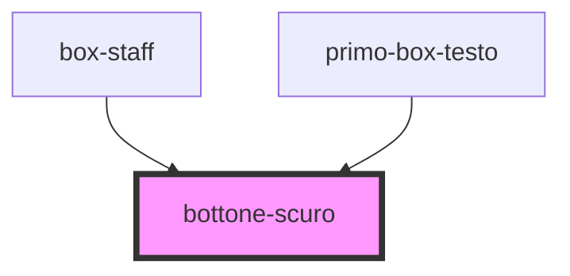

# bottone-scuro

<!-- Auto Generated Below -->

## Properties

| Property       | Attribute        | Description                         | Type     | Default     |
| -------------- | ---------------- | ----------------------------------- | -------- | ----------- |
| `btnTextScuro` | `btn-text-scuro` | Bottone scuro con lo sfondo #02336E | `string` | `undefined` |

## Dependencies

### Used by

 - [box-staff](../box-staff)
 - [primo-box-testo](../primo-box-testo)

### Graph

----------------------------------------------

*Built with [StencilJS](https://stenciljs.com/)*
