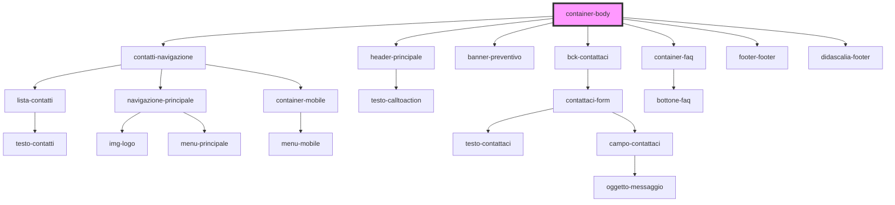

# container-body

<!-- Auto Generated Below -->

## Dependencies

### Depends on

- [contatti-navigazione](../contatti-navigazione)
- [header-principale](../header-principale)
- [banner-preventivo](../banner-preventivo)
- [bck-contattaci](../bck-contattaci)
- [container-faq](../container-faq)
- [footer-footer](../footer-footer)
- [didascalia-footer](../didascalia-footer)

### Graph

----------------------------------------------

*Built with [StencilJS](https://stenciljs.com/)*
