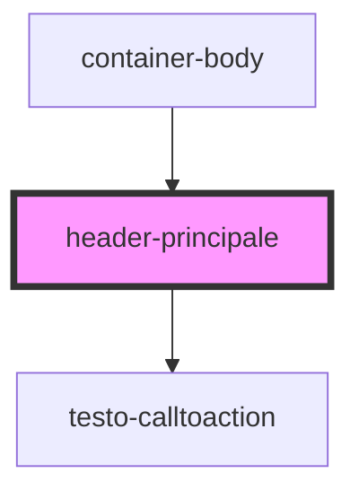

# header-principale

<!-- Auto Generated Below -->

## Dependencies

### Used by

 - [container-body](../container-body)

### Depends on

- [testo-calltoaction](../testo-calltoaction)

### Graph

----------------------------------------------

*Built with [StencilJS](https://stenciljs.com/)*
