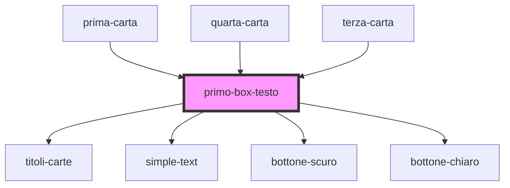

# primo-box-testo

<!-- Auto Generated Below -->

## Dependencies

### Used by

 - [prima-carta](../prima-carta)
 - [quarta-carta](../quarta-carta)
 - [terza-carta](../terza-carta)

### Depends on

- [titoli-carte](../titoli-carte)
- [simple-text](../simple-text)
- [bottone-scuro](../bottone-scuro)
- [bottone-chiaro](../bottone-chiaro)

### Graph

----------------------------------------------

*Built with [StencilJS](https://stenciljs.com/)*
