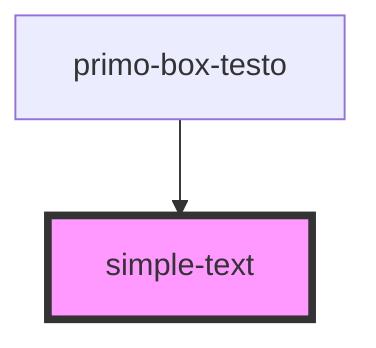

# simple-text

<!-- Auto Generated Below -->

## Properties

| Property     | Attribute     | Description                                              | Type     | Default     |
| ------------ | ------------- | -------------------------------------------------------- | -------- | ----------- |
| `simpleText` | `simple-text` | Prop per rendere il testo variabile all'interno del sito | `string` | `undefined` |

## Dependencies

### Used by

 - [primo-box-testo](../primo-box-testo)

### Graph

----------------------------------------------

*Built with [StencilJS](https://stenciljs.com/)*
