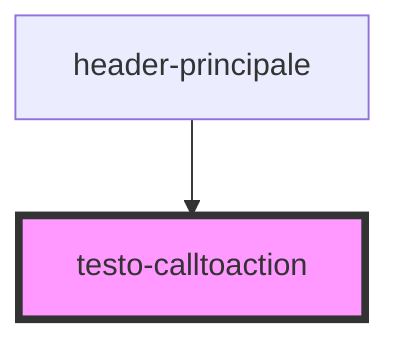

# testo-calltoaction

<!-- Auto Generated Below -->

## Dependencies

### Used by

 - [header-principale](../header-principale)

### Graph

----------------------------------------------

*Built with [StencilJS](https://stenciljs.com/)*
