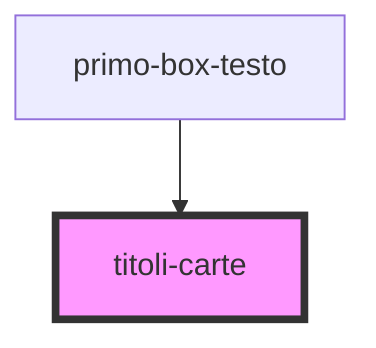

# titoli-carte

<!-- Auto Generated Below -->

## Properties

| Property    | Attribute    | Description                                                 | Type     | Default     |
| ----------- | ------------ | ----------------------------------------------------------- | -------- | ----------- |
| `cardTitol` | `card-titol` | Prop per rendere variabile i titoli all'interno delle carte | `string` | `undefined` |

## Dependencies

### Used by

 - [primo-box-testo](../primo-box-testo)

### Graph

----------------------------------------------

*Built with [StencilJS](https://stenciljs.com/)*
